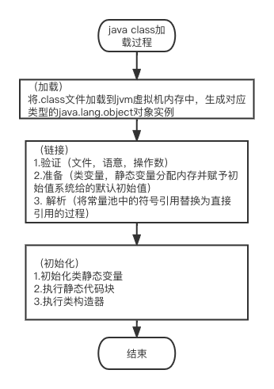

java在new一个对象的时候，会先查看对象所属的类有没有被加载到内存，如果没有的话，就会先通过类的全限定名来加载。加载并初始化类完成后，再进行对象的创建工作。

我们先假设是第一次使用该类，这样的话new一个对象就可以分为两个过程：加载并初始化类和创建对象。

一、类加载过程（第一次使用该类）
java是使用双亲委派模型来进行类的加载的，所以在描述类加载过程前，我们先看一下它的工作过程：

双亲委托模型的工作过程是：如果一个类加载器（ClassLoader）收到了类加载的请求，它首先不会自己去尝试加载这个类，而是把这个请求委托给父类加载器去完成，每一个层次的类加载器都是如此，因此所有的加载请求最终都应该传送到顶层的启动类加载器中，只有当父类加载器反馈自己无法完成这个加载请求（它的搜索范围中没有找到所需要加载的类）时，子加载器才会尝试自己去加载。
使用双亲委托机制的好处是：能够有效确保一个类的全局唯一性，当程序中出现多个限定名相同的类时，类加载器在执行加载时，始终只会加载其中的某一个类。

1、加载

由类加载器负责根据一个类的全限定名来读取此类的二进制字节流到JVM内部，并存储在运行时内存区的方法区，然后将其转换为一个与目标类型对应的java.lang.Class对象实例

2、验证
格式验证：验证是否符合class文件规范
语义验证：检查一个被标记为final的类型是否包含子类；检查一个类中的final方法是否被子类进行重写；确保父类和子类之间没有不兼容的一些方法声明（比如方法签名相同，但方法的返回值不同）
操作验证：在操作数栈中的数据必须进行正确的操作，对常量池中的各种符号引用执行验证（通常在解析阶段执行，检查是否可以通过符号引用中描述的全限定名定位到指定类型上，以及类成员信息的访问修饰符是否允许访问等）

3、准备
为类中的所有静态变量分配内存空间，并为其设置一个初始值（由于还没有产生对象，实例变量不在此操作范围内）
被final修饰的static变量（常量），会直接赋值；

4、解析
将常量池中的符号引用转为直接引用（得到类或者字段、方法在内存中的指针或者偏移量，以便直接调用该方法），这个可以在初始化之后再执行。
解析需要静态绑定的内容。  // 所有不会被重写的方法和域都会被静态绑定

以上2、3、4三个阶段又合称为链接阶段，链接阶段要做的是将加载到JVM中的二进制字节流的类数据信息合并到JVM的运行时状态中。

5、初始化（先父后子）
4.1 为静态变量赋值

4.2 执行static代码块

注意：static代码块只有jvm能够调用
如果是多线程需要同时初始化一个类，仅仅只能允许其中一个线程对其执行初始化操作，其余线程必须等待，只有在活动线程执行完对类的初始化操作之后，才会通知正在等待的其他线程。

因为子类存在对父类的依赖，所以类的加载顺序是先加载父类后加载子类，初始化也一样。不过，父类初始化时，子类静态变量的值也有有的，是默认值。

最终，方法区会存储当前类类信息，包括类的静态变量、类初始化代码（定义静态变量时的赋值语句 和 静态初始化代码块）、实例变量定义、实例初始化代码（定义实例变量时的赋值语句实例代码块和构造方法）和实例方法，还有父类的类信息引用。

二、创建对象
1、在堆区分配对象需要的内存

分配的内存包括本类和父类的所有实例变量，但不包括任何静态变量

2、对所有实例变量赋默认值

将方法区内对实例变量的定义拷贝一份到堆区，然后赋默认值

3、执行实例初始化代码

初始化顺序是先初始化父类再初始化子类，初始化时先执行实例代码块然后是构造方法

4、如果有类似于Child c = new Child()形式的c引用的话，在栈区定义Child类型引用变量c，然后将堆区对象的地址赋值给它

需要注意的是，每个子类对象持有父类对象的引用，可在内部通过super关键字来调用父类对象，但在外部不可访问

补充：
通过实例引用调用实例方法的时候，先从方法区中对象的实际类型信息找，找不到的话再去父类类型信息中找。

如果继承的层次比较深，要调用的方法位于比较上层的父类，则调用的效率是比较低的，因为每次调用都要经过很多次查找。这时候大多系统会采用一种称为虚方法表的方法来优化调用的效率。

所谓虚方法表，就是在类加载的时候，为每个类创建一个表，这个表包括该类的对象所有动态绑定的方法及其地址，包括父类的方法，但一个方法只有一条记录，子类重写了父类方法后只会保留子类的。当通过对象动态绑定方法的时候，只需要查找这个表就可以了，而不需要挨个查找每个父类