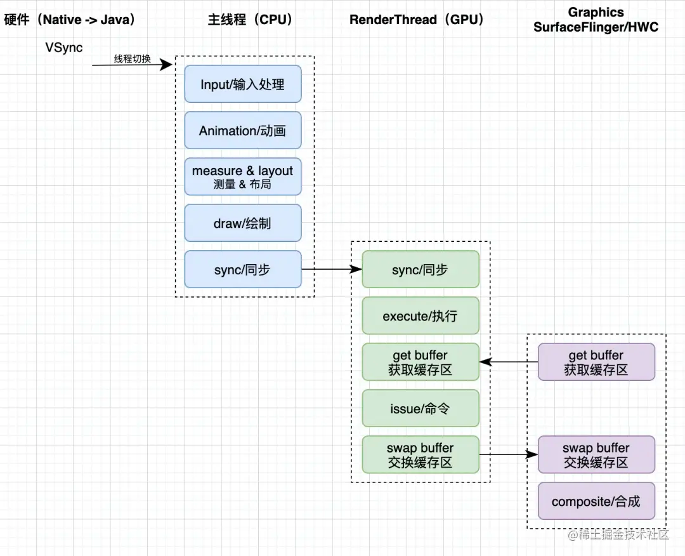

## Activity window view 三者的关系

- activity attach时，创建Window实例`phoneWindow`，设置各种callBack，并且与WindowManager相关联，对应ViewRootImpl
- activity onCreate时，调用setContentView 方法将xml布局文件设置给activity-> phoneWindow.setContentView
- phoneWindow 根据theme创建DecorView，并将xml，add到decorView中
- activity onResume 时，将decorView添加到window中。添加过程中WindowMangerImpl通过创建viewRootImpl来管理DecorView的事件（包括add，remove等）
- ViewRootImpl 通过requestLayout来控制整个事件的绘制流程

#### Activity 中 Window 创建过程

