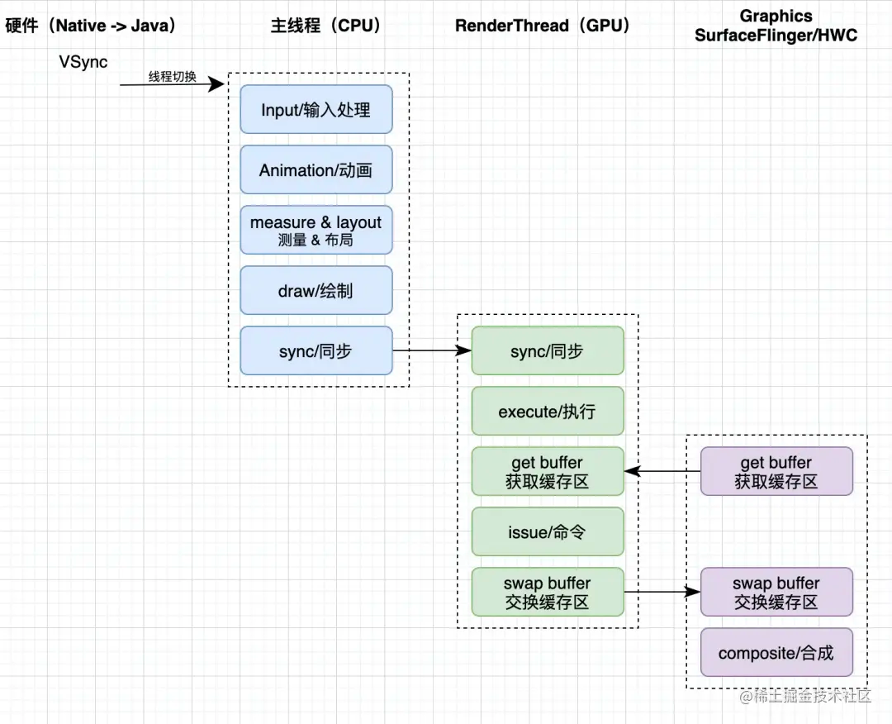

### 渲染流程

我们都知道，当触发渲染后，会走到 ViewRootImpl 的 scheduleTraversals。这时，scheduleTraversals 方法主要是向 Choreographer 注册下一个
VSync 的回调。当下一个 VSync 来临时，Choreographer 首先切到主线程（传 VSync 上来的 native 代码不运行在主线程），当然它并不是直接给 Looper
sendMessage，而是 msg.setAsynchronous(true) ，提高了 UI 的响应速率。

当切到主线程后，Choreographer 开始执行所有注册了这个 VSync 的回调，回调类型分为以下四种：

1. CALLBACK_INPUT，输入事件
2. CALLBACK_ANIMATION，动画处理
3. CALLBACK_TRAVERSAL，UI 分发
4. CALLBACK_COMMIT 同步

Choreographer 会将所有的回调按类型分类，用链表来组织，表头存在一个大小固定的数组中（因为只支持这四种回调）。在 VSync
发送到主线程的消息中，就会一条链表一条链表的取出顺序执行并清空。 而在 scheduleTraversals 注册的就是 CALLBACK_TRAVERSAL 类型的 callback，这个
callback 中执行的就是我们最为熟悉的 ViewRootImpl#doTraversal() 方法，doTraversal 方法中调用了 performTraversals
方法，performTraversals 方法中最重要的就是调用了耳熟能详的 performMeasure、performLayout、performDraw 方法。

从这里我们可以看到，想要上屏一帧数据，至少包括：VSync 切到主线程的耗时、处理输入事件的耗时、处理动画的耗时、处理 UI 分发(measure、layout、draw)的耗时。

然而，当 draw 流程结束，只是 CPU 计算部分结束，接下来会把数据交给 RenderThread 来完成 GPU 部分工作。

### 屏幕刷新

